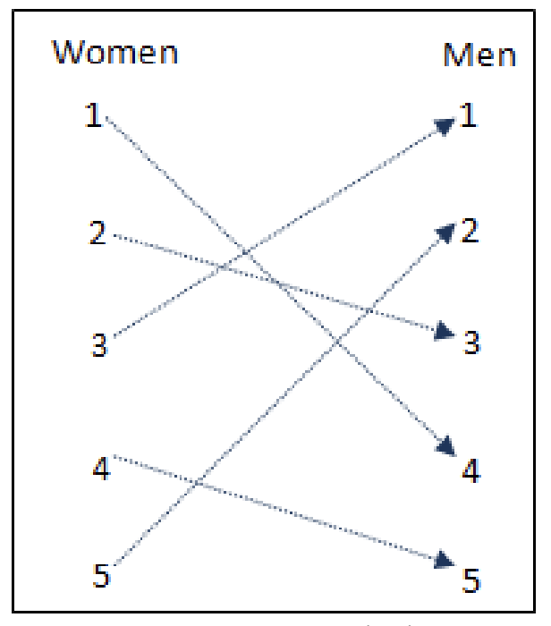
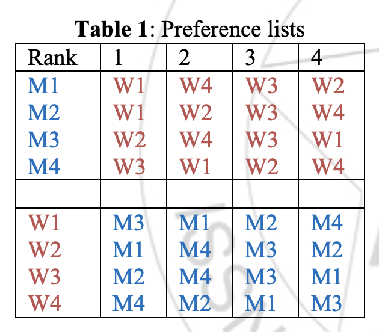

# smp_ga

## 유전자 및 리스트 표현 방법
> 숫자는 0부터 센다

### 1. 관계



> 아래와 같이 표현할 수 있음

```python
[3, 2, 0, 4, 1]
```

---

### 2. 선호도



> 아래와 같이 표현할 수 있음

```python
# 여성에 대한 남성의 선호도 목록
pm = np.array([
    [0, 3, 2, 1],
    [0, 1, 2, 3],
    [1, 3, 2, 0],
    [2, 0, 1, 3]
])

# 남성에 대한 여성의 선호도 목록
pw = np.array([
    [2, 0, 1, 3],
    [0, 3, 2, 1],
    [1, 3, 2, 0],
    [3, 1, 0, 2]
])
```