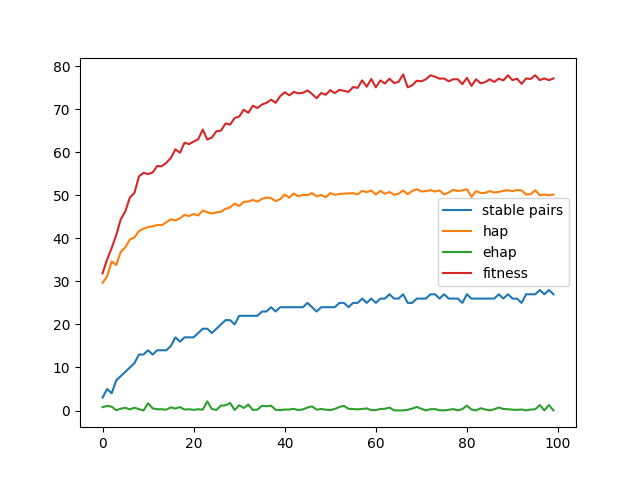
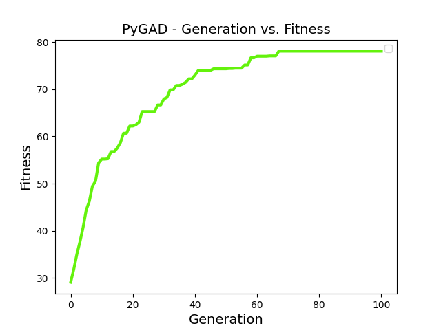

# 결과

```
남녀 쌍 수: 30

반복 횟수: 100
세대 당 솔루션 수: 50
선택 솔루션 수: 10

교차 비율: 10%
돌연변이 비율: 90%
```

### 세대별 hap, ehap, stable pairs 변화 

> 가장 최적의 경우에서 stable pair 수는 약 27 정도로 이론상 최대인 30보다 낮음

> 안정성을 희생할 때 가능한 한 최상의 매칭을 얻을 수 있다는 점이 흥미로움



---

### 세대별 fitness 변화

> 세대가 지남에 따라 fitness는 증가하며 점차 수렴함



---

### 예시 테스트

#### 결과
```python
Parameters of the best solution : [10 29 20  8  7  2  6 15 26 21 27 23 16 18 11  1 13  9 25 22 12 19 17 28 0  5 24 14  4  3]
Fitness value of the best solution = 78.06666666666666
```

#### 사용한 선호도 목록
```python
pm = [[ 2 23  8 16 25 14  9  3 19 28 20 24 10 26  7 13 22  5 27 12  1 29 18 15
  21  6  0 17  4 11]
 [ 9 11 15 16 14 22  6  1 21 12 27  7  8  5 23 10  0 18 17  2 13 24 19 29
  28 26  4 20  3 25]
 [ 4  6 16 15 25 18  7  1 24 28 13  8 10  5 20 21  0 19 17  3 23 12 26 22
  14  2  9 27 11 29]
 [ 5 29  9 26  4 20  6 17  2 19 13 16 15  0  1 23 24 18 21 11  3 14 12  8
  27 25 22 28  7 10]
 [28 13  9 14  5  0 25 19  6  7 12 17 24 27 16 21 15  8  2 10 29 18 22 11
  20 23  4  1  3 26]
 [21 27 29 22 19 10  4  5 17 28  3 20 24 16  0 12 13  7  8 11 25 15  1  6
  14  2 23 18 26  9]
 [11 14  9 21 22 26  7 27  2 13 25  8  6 23 12  5 10 17 28 19  1  0 16 24
  20 15  4  3 29 18]
 [13 21 29  4 28 12  3  0  9 19 20 26 23 15 25  7  6  5 16  1 18  2 27 24
  14 11  8 10 22 17]
 [11  3 20 28 12 19 10 26 27  4 17 14  6  9  5 15 13  0 24 16 23 29  1  7
   2 18  8 25 22 21]
 [ 6 13 21 18 15  9 19  0  8 24 17 26 16  7 20  4 10 11 25  1 22 29  2 27
  12 28  3  5 23 14]
 [19 29 17  0 20 12 28 24 18 22 23  5 27 11  3  2 21 25  8  1 26 10 14  6
  13 16 15  4  7  9]
 [15 14 17  0 27 26 24 16 25 20  5  9 11 23  2 21  6  8  4 10 29 28 12 13
  19  1  7  3 18 22]
 [29 20 22 25 19 16  4 27  9 21 11  6  7  0 24  2 17 13 12 26  8  1  3 15
   5 10 18 28 23 14]
 [ 6 27  2  5  4 10 16 25  7 18 17 23 21 19  9 12 28  1 14 24 20  0 11 29
   3 26 22 15  8 13]
 [18 27 28  5 15  3 13  8  1 19  0 24  9 29 11 10  4 25 12 14 16  2 20 17
  23 21 26 22  6  7]
 [ 2  4 24 18 17  0 14  9 27  7 10 29  6 28 20  1 11  3 25 21 16 15 13 22
  12 26 19  8 23  5]
 [12  2 26  4  3 19 11 23  7  5  8  9 16  6 13 21 25 14 18 20 15 10 28  0
   1 24 27 29 22 17]
 [26 22 24  2  0 14  3 28 13 11 25 21 16 15  5  8  6  9 27 12 10 19  4  7
  18 17  1 23 29 20]
 [11  1 19 15 14  3 27 29  4 13  9 28 22 12  2  8 23  5 18  0 20 16 17 10
   7  6 26 21 24 25]
 [18 21 17  6 27 16 28 23 12  1 20  4 10 14  5  9  7 11  0 29 19  2 13 25
   8 24 22  3 15 26]
 [ 2  1 26 29  0 25 10 14 22  4 20 23 21  5 12 17  6 19 15  8 16  9 18  3
  11 13  7 28 27 24]
 [ 9  8 21 29 17  7 23  0 16  2 27 15 18 19 28  3 13 24  5 10 26 12  6 20
  11 22  4 14 25  1]
 [19 27  9  2  4 20 17 22  3 15 25 29 13  7 11 16 24  1 18 10 21 12 26 28
   6  0 23 14  8  5]
 [21 11 15 17 16  0  1 24  2 26 27 14 20 12 19  9  6 13  8  3  7 23  5 25
  10 22 29 28  4 18]
 [23 18  7  8 22 26 16  1 28  3  6  0  2 15 19  9 25 14 17 13 10 24  5  4
  12 20 29 27 11 21]
 [ 4 10  8 18 22 12 13  5 25  6 14  1  7 29 20 24 28  3 21 27  2 26 15  9
  16 19 17  0 23 11]
 [21  5 27 18 15 19 17 13  1  8 11 26  0 24 16 20  9  7  2  6 12 28 29  4
  23  3 22 25 10 14]
 [16 19 13 10 23 27  0  8 21  6 26 29  3 24 25 15  1 22 12 18 14  5 28 17
   2 11 20  4  7  9]
 [20 23  8 27 18 15 16  1 12  7 14  2 24 26 11 21  5  0 13 22  3 29 17 10
   9  6 19 28  4 25]
 [ 6  9 22  3 19 24  1 15 20  0  7 12  5 23 25 14 11 29 13 10  4 21  2 17
  27 16 18  8 28 26]]

pw = [[24 20 10 12  5 29 13  6 18 27  1  8 25 17 21  9  4  3  7 14  2 15 19 23
  16  0 26 22 28 11]
 [29 22  7 28 27  5 23  9 24  6 16 17  1 14 11 12 13 19 26 21  2  3 25  4
  15 18 20  8 10  0]
 [10 28 24 12 19 20 27  1  8 17  7  4 26 23 18 11  9  0 13 21  6 15  2  5
  25 16 29  3 14 22]
 [17 22  3 18 28 27  6  0  1 20 21  8 29  7 13 12 26  9  2 24 10  4 14 15
  16  5 19 11 25 23]
 [ 7 22 29 18 16 13 24 15 23 27 10  2  9 14 28 26  5 12 19  4 25  0 21  3
   6 11 17  1  8 20]
 [27  4 15 21  6 12  2 16 18 13 10 26 20 23  7 22  9  1 11 29  0 24 17  5
  25 19  8  3 14 28]
 [ 1 21  3 16 28 25 24 19  4 11  6 13 18 17 20  7 14  8 26 27  9 29 23 22
   5  2  0 10 12 15]
 [ 7 17 28 20 14  4 21 19  0 29 10 25  1 26 18  3 15 23  2 27  6 11 16 12
  22  9 24  8  5 13]
 [29 26 28 27  7 23 15 20  0 11 21  1  5 24 17  2 25  6  4 12 13  9 16 10
  22  3 19 18  8 14]
 [ 7 21 22 14 17  2 25 16 19  1 18 29  3  9 20 15 28 27 26 12 11  0  5 10
   8  4  6 13 23 24]
 [11 19 26 22 27  8 14  4  3 18  5 13  1  9 28 21 20 10 15 23 29 12  7 25
   0 17  6 24 16  2]
 [16 14  9 19 21 23 13  4  5  0 12 22 18 29  6 27 11 15 17 20 26  8 10  3
  28  2 24 25  7  1]
 [18 27  7  4  6 16 23 19 20  5 14 15 25  2 26 29 21 22  0  8 10 12 17 24
  11 13  9 28  1  3]
 [18  1 28 16 10 15 29 22 21 25  8  7 27 14 13  0  3 12 11  4 23 19  2  9
  26 20 24  6 17  5]
 [14 29 26 12 11 10 15  2  9  6 22 19  4 17 16 13 27 20 28 21  3 23 18  8
  24  0 25  7  1  5]
 [ 8  1 14 10 18 17 15  6 23 19 28 29  7 25  0  2  4 22 26 20 11 27  9  5
  21 13 12 16 24  3]
 [14 28  6 13  3 18  0 17  8 27 24 15  7  4  9 22 19 12 11 26 23 10 29  1
  20  5  2 21 16 25]
 [26  8  7 18 10 21 14 25  3  5 12  1  0 16 24 22 27  9 23  6 15 29 11 20
  17  2 19 28 13  4]
 [25 19 29 26 20 11  6  3  4 14 23 13  5  7  9 12 16  0 10 21 22 18  1 15
  24 28 27  2  8 17]
 [22 11 18  4  9 29 14 25  6 27 20 19 10 13 16 24 15 28  1  2 21  3 26 23
  12  5  8  7 17  0]
 [ 4 19 12 24  1  0 16  7 10 11 26  8 27  2 17 29  3 20 14 23 18 13  9 21
   5 28 22 15 25  6]
 [18  0 11 10  3 19 26 24 22 12  6 14 20  1 16  7 17 28 13 29 23  4 21  9
  27  2 25  8 15  5]
 [25  1 15  8 27 17 26 29  6 23  9 19  0 24  4 16 13 21 14  7 28 11  3  5
  12 20 10  2 22 18]
 [17 15  1 13 28 29  4 21  9 12  3 11 14  5 23  6 27 20  8 19 24 22 10  0
   7 25  2 18 16 26]
 [20  0 17 12 16  4 25 26  1 13  2 29 10  5 27 24 15  3 18 28 11  9 22  6
   7 14  8 21 19 23]
 [13 19 18  8 12  5 25 28 14 16  4 15  6 21  7 23  2 10 20 24  9 11  1 26
  27  0 17 22  3 29]
 [13 26  7 14 18 11 22  1 19 24 12  0 17  5 16 27  6 23 10  8  9  4 20  2
  25 29 28 21  3 15]
 [17 14 21 22 26  2 29 19  8 27  7 11 23  9 15 10  6 28 16  3  5 24  1  0
  20 12  4 25 13 18]
 [13  4  8 17 21  9 27  7  3 11 15 22 16  1 20 24 28 18  2 29  5 12 14 19
  25 26 10  0 23  6]
 [14 24  2 15 11  4 12  5 21 26  3 16 27 18 25 17  6 23 20 28  8  1  0  9
  13 19 29 10  7 22]]
```